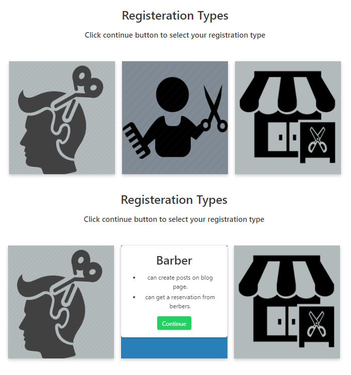
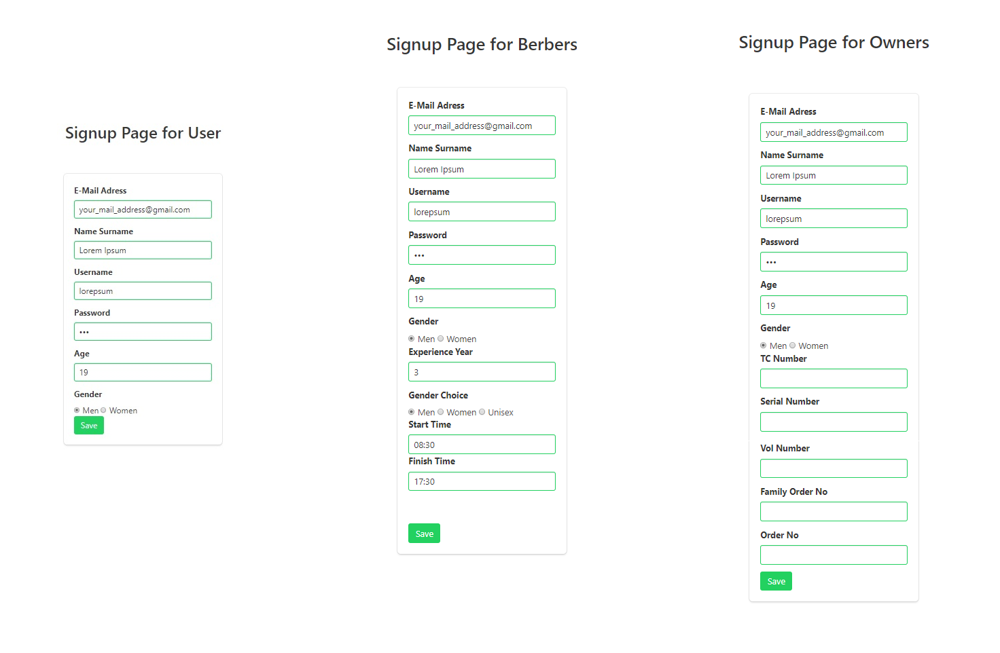
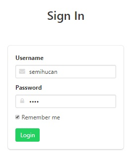
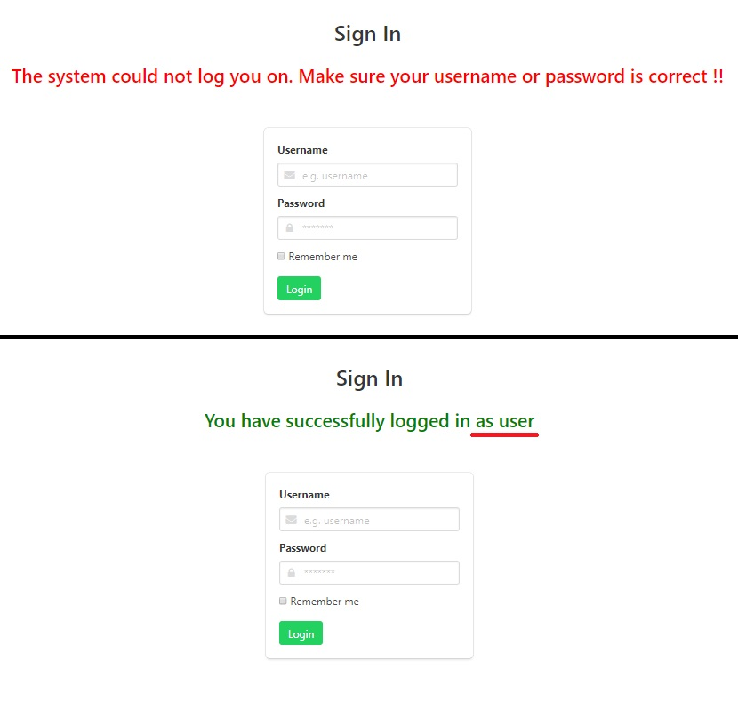
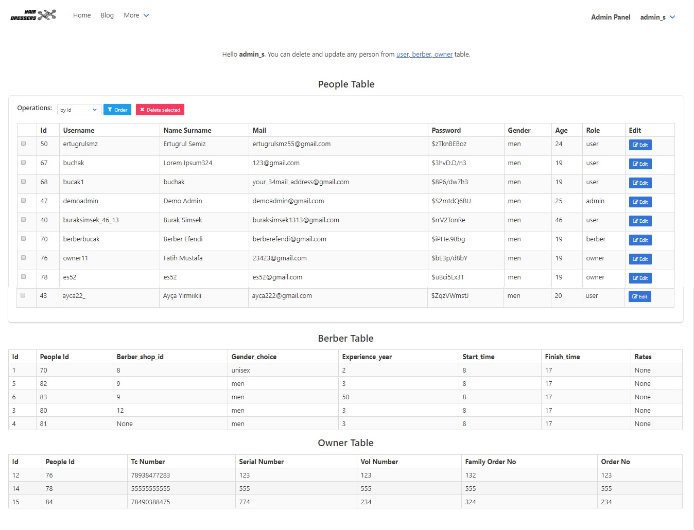
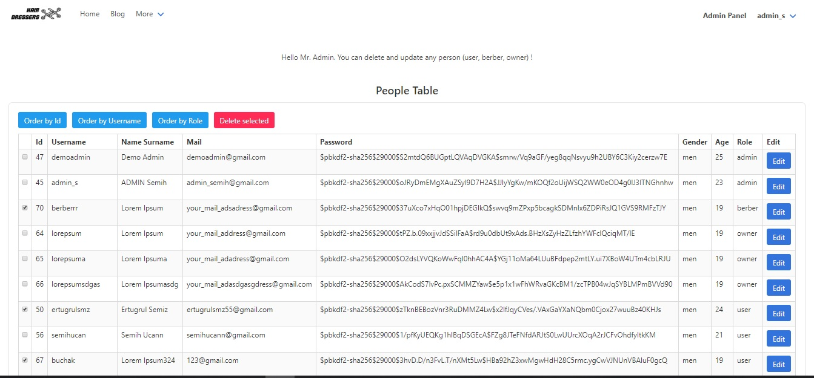
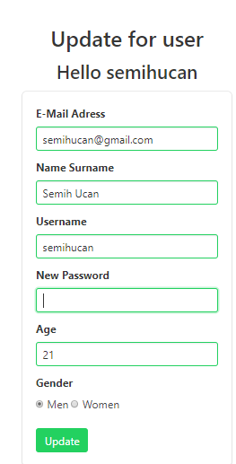
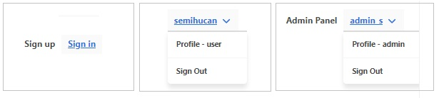

Parts Implemented by Ahmet Semih Uçan
=====================================

Signup Flow
-----------

I've created a register type selection page to register a person to the website.
3 different types of records meet client on this page.
When the icons are over, the icon with js rotates and informs about the type of recording.
Clicking Continue button leads to the signup page. (By subject)

   Register Type Page

According to the register type preference, I redirected the client to one of the pages in the image below. On this page I received information from the user in accordance with the type of user, barber and owner. I have written 3 different insert functions to add the incoming information to the tables. Username, mail and tc_number is unique so I checked this values for validation.

   Signup Page

Signin Flow
-----------
In signin page, I get username and password from client. After this operation, I hash the password with passlib.hash library and check.

   Signin Page

- If written username and password is correct, "You have successfully logged in <TYPE>" message is shown.
- If written username and password is wrong, error message is shown.

   Signin Page Respond

Admin Panel
-----------

If person signin to web site as admin, admin panel can be used.
In admin panel, people berber and owner tables are shown.
The panel provides update and delete facilities on 3 tables.

   Admin Panel

Admin Panel Operations
----------------------

- To delete any user, mark the check_box in the first column of people table and click the "delete selected" button.
- To order table, select order type from select_box and click the order button
- To edit any person, click the rightmost button on that person's row and

3 different delete operation by person type for tables(people, berber, owner)

3 different update operation by person type for tables(people, berber, owner)

- If person doesn't login, navbar is shown like that first part of picture.
- If person login and person isn't admin, navbar is shown like that second part of picture.
- If person login and person is admin, Admin Panel url will be added to navbar and navbar is shown like that third part of picture.

Navbar Edition
--------------

Navbar links changing according to the type of person logging in
