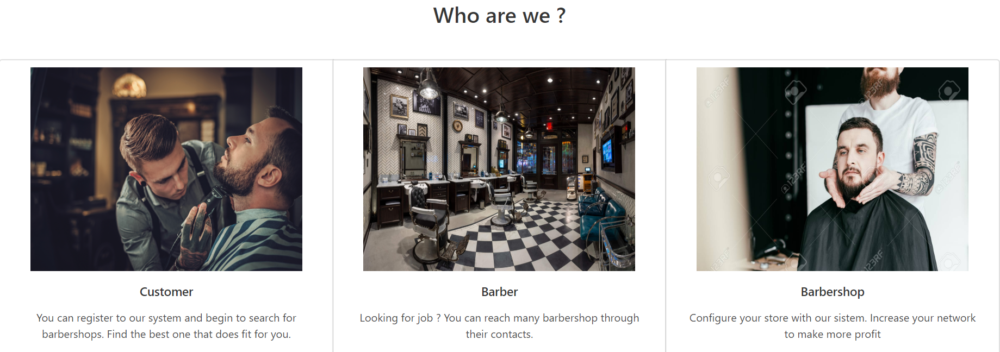
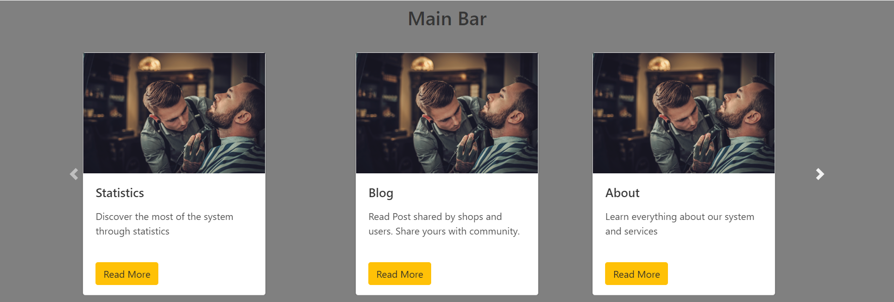
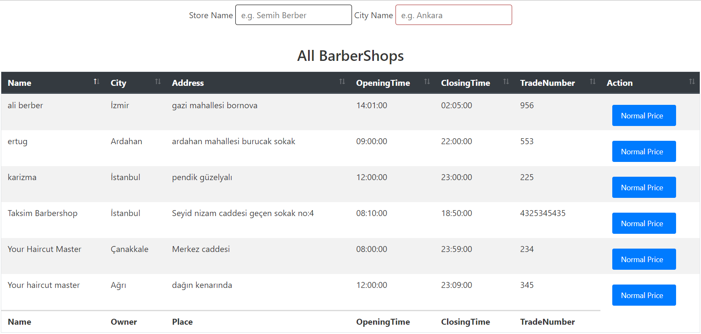
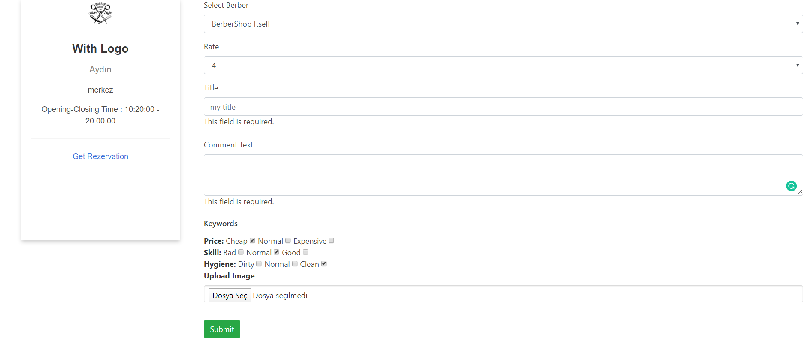
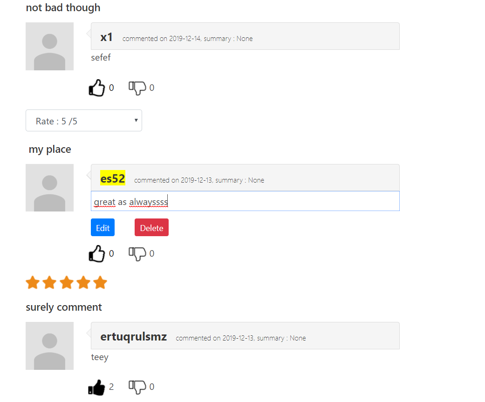
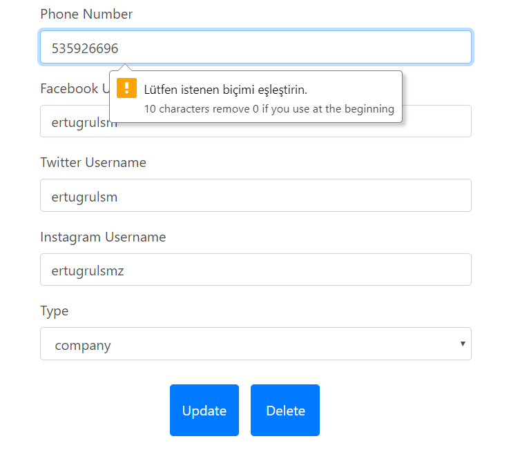
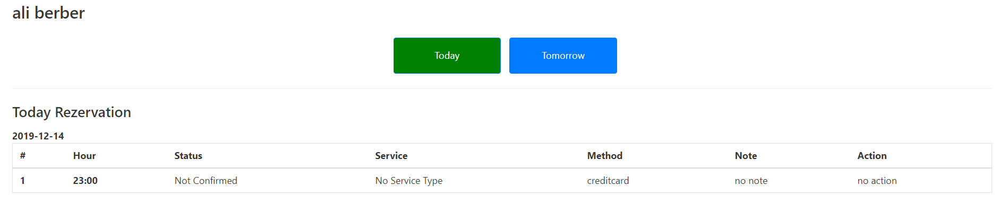
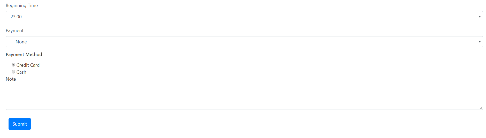
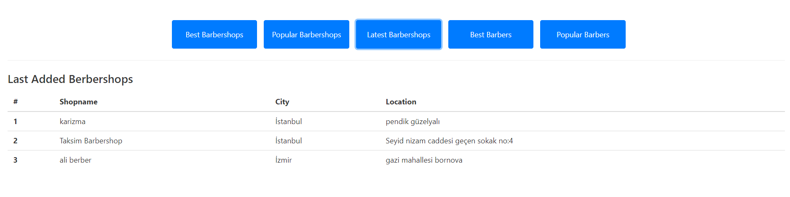

Parts Implemented by Ertugrul Semiz
=====================================

Main Page
-----------

I've created main page of website (except navigation bar which is common for all page). In the first part of main page there is
bootstrap carausel which has 3 navigators : who are we , main bar, all barbershops which direct to the corresponding area in the
same page through buttons on them.

- Who are we  :
Information about our system. Informations about Customers,Barbers,Owners and their functionalities.

- Main Bar :
General links exists here. Visitors directly reach most of the features from this  sliding carousel.

All Barbershops :
It is the table having list of all the barbershops in the systems. Name of the shop, City, Address etc. In this table there is two
input areas which are name of the shop and city. You can filter the barbershops you are looking for here. In cities input area, it also
does provide list of cities of the existing barbershops in the system.
There is also link which users can access berbershopview page which includes info about barbershops, comments made by customers also direct links to the
take rezervation.

BarbershopView
--------------
In this page, more informations about barbershop is listed which is clicked from all barbershops table. Opening-Closing time, phonenumber
city,adress, social media accounts with icons etc. many properties is reachable. If the current_user is owner of the that shop, he/she can have acces to contact settings
page from shop card.

- What is more, user can direct to rezervation page from the barbershopcard.
Other than general knowledge of that specific barbershop, there is a form for comment. In this form, a comment can be made for
barbershop itself, or the existing barbers of that barbershop. User can specifiy rate and write comment title and text.

-There are optional keywords summarize your comment consisting of three category as price,skill,hygiene. User can click those if it is useful for comment
or can leave them blank if they don't like there keywords.

- With image file upload part, user can support his/her ideas with pictures.

Comments Part
List of the comment that has been made for this barbershop.

- If comment belongs to current user, comment will be with editable text and title, also select input rerating the shop managed with edit button
- If comment belongs to current user, comment can be deleted via delete button
- If there is current user in the system, comments can be liked or disliked yet if there is not, it will direct to signin page
- Like-Dislike system works similar to social media apps. If you dislike comment that you already liked, your like  will be gone and vice-versa.
- Like-Dislike system works as a counter, increases or decreases by the clicks.

Contact Page
------------

If current user is owner of that barbershop, the contact link will be available for the barbershop card. Via this link, contact info
form will be opened. If there is no record, new one will be added by add button. If there is already exists, then update and delete
options will be provided. Validation for the phone number is made here. Besides, owner can fill areas about social media account of
store or type of the contact.

Rezervation Page
----------------------
Current user can do rezervation for that specific shop, otherwise it has to sign in first. There is 2 section for rezervation which
are rezervation of today and tomorrow. The button at the above of page, brings corresponding form and tables dynamically. In rezervation
form, payment method, note, rezervation hour, and the operation type will be arranged by the user for the available slot.

- Today appointment hour list consist of the hours after now.
- Tomorrow, all hours will be available.
- Registered operations and corresponding informations about it, is listed in the table at the above of the form.
- If appointment belongs to current user, it can be edited or deleted.

Statistics Page
---------------
Extra Statistic page that is directed from main page. There are 5 subsections stands for each statistic table. When the buttons at
the above of the page is pressed, it dynamically brings the corresponding statistic table. Generally, top 3 most element of result is listed.

