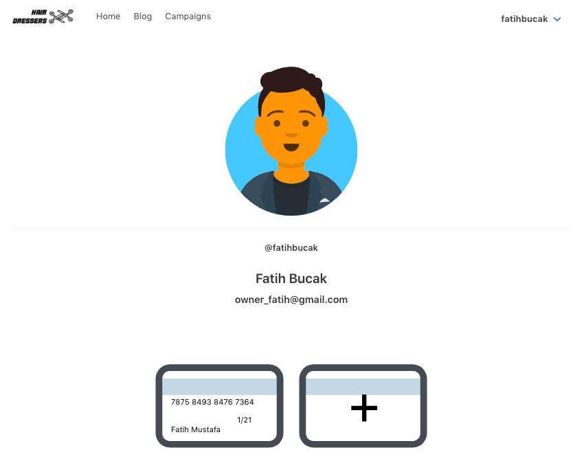
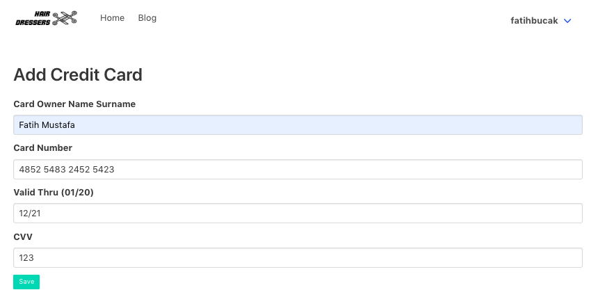
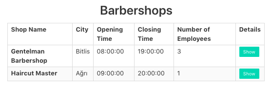
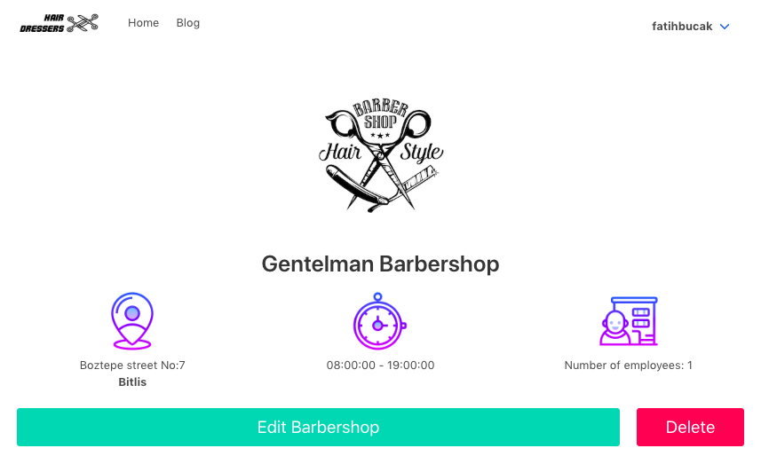
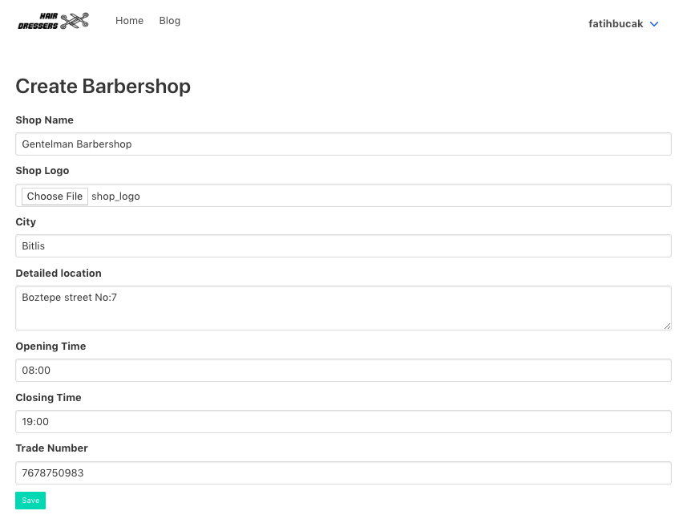
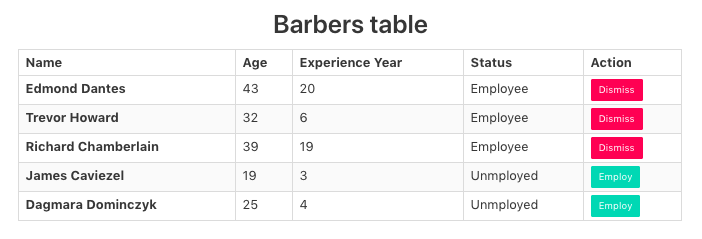
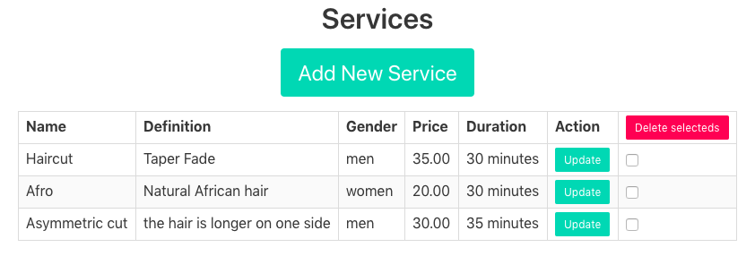
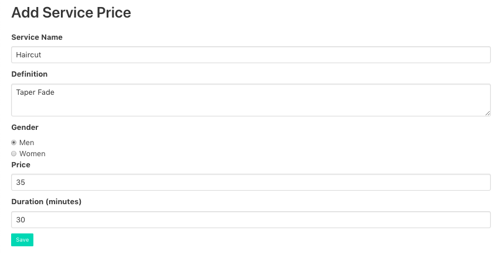

Parts Implemented by Fatih Mustafa Bucak
========================================

Profile Page
------------

Profile page has different functionalities according to current user in the page.

- Client and barber users have access to their credit cards.
- Owner users have access to create their shops and save barbers as employee of the shops.

   Person logo changes according to user's gender. List of credit cards can be seen below of the page.

**Credit Card**

- All users can see, add, edit and delete their credit cards which are used while making reservation.

   All fields are required to save credit card.

**Barbershops Table**

- Owners can create and manage their barbershops in profile page.

   Show button is redirected to barbershop page.

Barbershop Page
---------------

- Barbershop page is designed for owners of shops. Owners can edit shops information and they can delete the shop in the barbershop page.

   Logo is optional. If the owner save a logo, the logo can be seen here.

- Owners can add and update shops.

   All fields are required except shop logo. If an owner doesn't select a shop logo, default image is shown in barbershop page.

**Employment**

- Owners can select employees of the shop from hairdressers table in barbershop page.

   Employees are listed above. Jobless barbers are listed below.

Services
--------

- Owners can see and delete services of the shops in barbershop page.

- Owners can add and edit services.

   All fields are required in the form.
