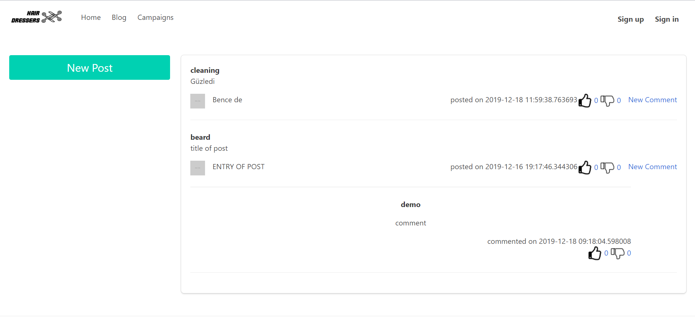
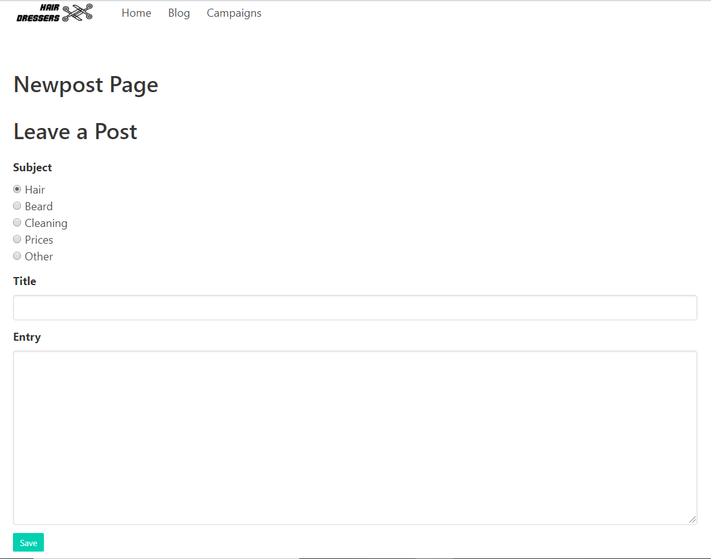
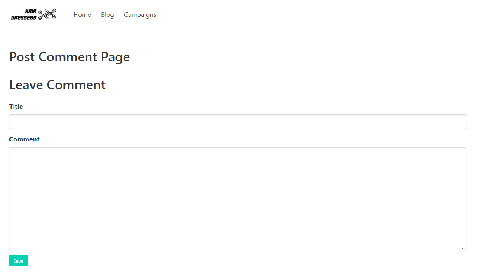
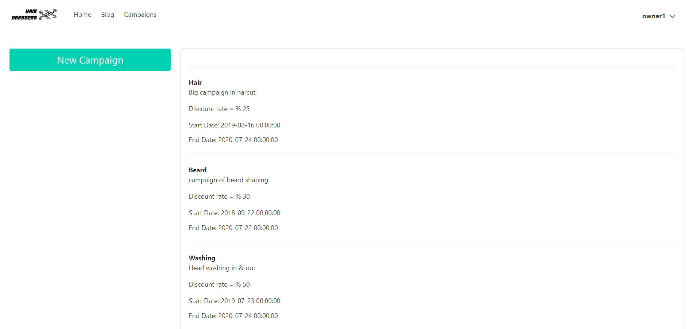
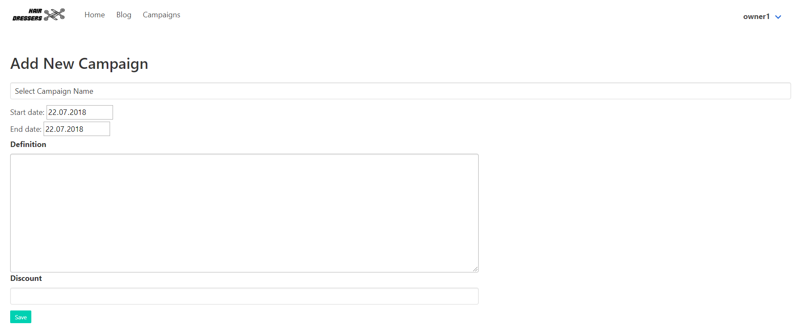

Parts Implemented by Halis Ibrahim Aydin
========================================

Blog Page
---------

I have created blog page of the website. In the blog page there is a link to the newpost page which is on top left.
Posts are shown on the right ordered by posted time and there are comments of posts which are below of the each post.

-

Posts Part
List of the posts.

- If post belongs to current user, post can be deleted via delete button
- If there is current user in the system, posts can be liked or disliked yet if there is not, it will direct to signin page
- Like-Dislike system works as a counter, increases or decreases by the clicks.

Comments Part
List of the comments for each post.

- If comment belongs to current user, comment can be deleted via delete button
- If there is current user in the system, comments can be liked or disliked yet if there is not, it will direct to signin page
- Like-Dislike system works as a counter, increases or decreases by the clicks.

Newpost Page
------------

Newpost page is the page where users enter new posts.

A user should ;
     - select subject of the post
     - enter title of the post
     - enter content of the post

Post Comment Page
-----------------

Post Comment page is the page where users enter new comment. A user should enter title of the post and content of the post.
Comment of the post will be shown under the post user commented.

Campaigns Page
--------------

Campaign page is the page which shows the campaigns of fees of hair cut or beard cut or blow-dry etc.

New Campaign Page
-----------------

New Campaign page is the page where barber enter new campaign. A barber should enter a name for the campaign, choose
start time and end time, enter definition of the campaign and discount rate.

